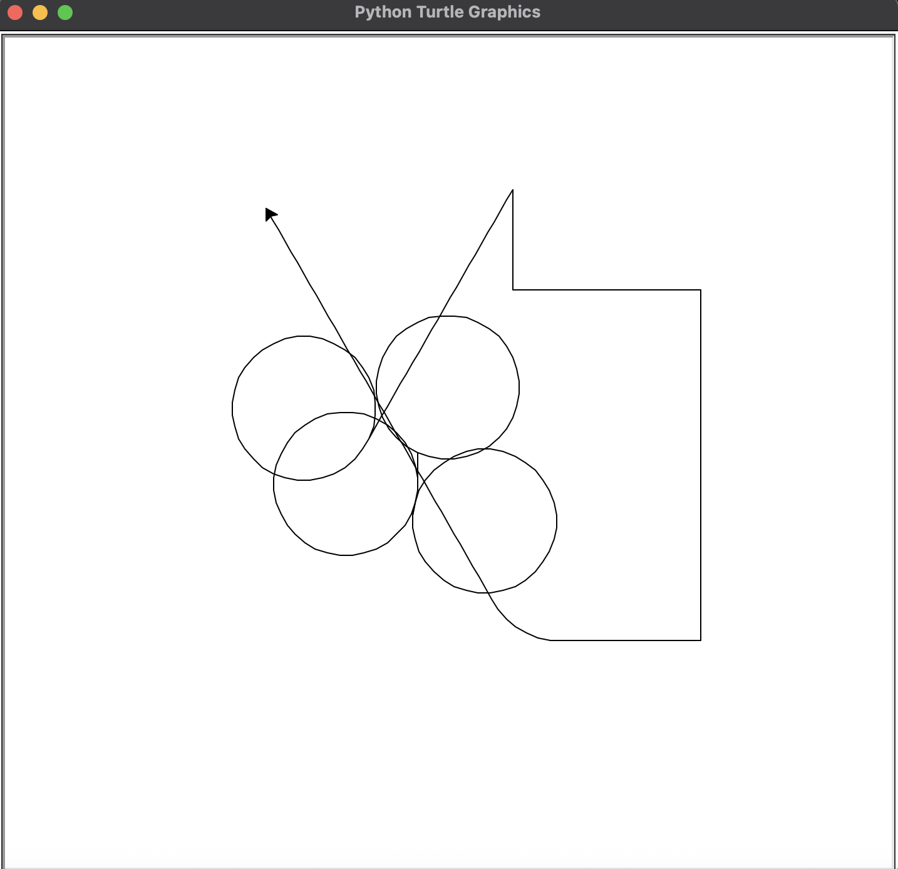

# 🐢 Turtle Drawing Controller

An interactive Python Turtle project where you control a turtle with your keyboard to draw, curve, and explore a virtual canvas!

---

## 🖼️ Example

Here’s a screenshot of the turtle in action:



---

## 🎯 Features

- Draw or move with keyboard controls
- Smooth turning using left/right curve controls
- Pen control (up/down) for clean or creative movement
- Clear or reset the canvas at any time

---

## 🎮 Controls

| Key  | Action                          |
|------|---------------------------------|
| `W`  | Move Up                         |
| `S`  | Move Down                       |
| `A`  | Move Left                       |
| `D`  | Move Right                      |
| `Z`  | Curve Left (Smooth turn)        |
| `X`  | Curve Right (Smooth turn)       |
| `F`  | Move Straight (no direction change) |
| `Q`  | Pen Down (start drawing)        |
| `E`  | Pen Up (stop drawing)           |
| `C`  | Clear the drawing canvas        |
| `R`  | Reset everything                |

---

## ▶️ Running the Program

Make sure you have Python 3 installed, then run:

```bash
python turtle_control.py
````

---

## 📁 File Structure

```
📁 your-project-folder
├── turtle_control.py
├── 1.png               # ← example image
└── README.md
```

---

## 🧠 How It Works

* Uses Python's `turtle` module — no extra libraries
* Functions are mapped to keys with `screen.onkey()`
* Curved movement adjusts heading by ±10 degrees while moving

---

## 📚 Acknowledgements

This project is inspired by a Python course I'm following. Some parts of the code structure are based on the course, but I’ve made key modifications and added features to better understand and practice Python development.

Thanks to the course creator(s) for the foundational learning!

---

## 💡 Tips for Expansion

* Add continuous movement with `screen.ontimer()`
* Change pen color with number keys
* Add shape-drawing shortcuts (e.g. draw square with one key)

---

## 📄 License

MIT License — free to use, modify, and share.


Happy coding and drawing! 🎨🐢

```

---
